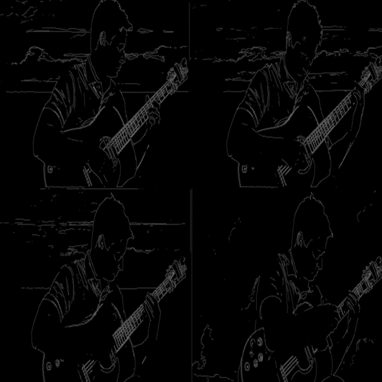

# AnimateDiff

This repository is the official implementation of [ID-Animator](https://id-animator.github.io/).
It is a Zero-shot ID-Preserving Human Video Generation framework. It can generate high-quality ID-specific human video with only one ID image as reference.

**[ID-Animator: Zero-Shot Identity-Preserving Human Video Generation](https://id-animator.github.io/)** 
 
[Xuanhua He](https://scholar.google.com/citations?user=-bDAN2YAAAAJ&hl=en&oi=ao),
[Quande Liu*](https://liuquande.github.io/),
[Shengju Qian](https://scholar.google.com/citations?user=QNnWmasAAAAJ&hl=zh-CN),
Xin Wang,
Tao Hu,
[Ke Cao](https://scholar.google.com/citations?user=3qMrWmgAAAAJ&hl=en&oi=ao),
Keyu Yan,
Man Zhou,
Jie Zhang*
(*Corresponding Author)

## Next
- [ ] Release ID-Animator checkpoints and inference scripts
- [ ] Release ID-Animator dataset and training scripts
- [ ] Release ID-Animator SDXL version

**Code will be released soon!**

## Abstract
Generating high fidelity human video with specified identities has attracted significant attention in the content generation community. However, existing techniques struggle to strike a balance between training efficiency and identity preservation, either requiring tedious case-by-case finetuning or usually missing the identity details in video generation process. In this study, we present ID-Animator, a zero-shot human-video generation approach that can perform personalized video generation given single reference facial image without further training. ID-Animator inherits existing diffusion-based video generation backbones with an face adapter to encode the ID-relevant embeddings from learnable facial latent queries. To facilitate the extraction of identity information in video generation, we introduce an ID-oriented dataset construction pipeline, which incorporates decoupled human attribute and action captioning technique from a constructed facial image pool. Based on this pipeline, a random face reference training method is further devised to precisely capture the ID-relevant embeddings from reference images, thus improving the fidelity and generalization capacity of our model for ID-specific video generation. Extensive experiments demonstrates the superiority of ID-Animator to generate personalized human videos over previous models. Moreover, our method is highly compatible with popular pre-trained T2V models like animatediff and various community backbone models, showing high extendability in real-world applications for video generation where identity preservation is highly desired.

## Human Video Generation Demos
### Recontextualization
<table class="center">
    <tr style="line-height: 0">
    <td width=25% style="border: none; text-align: center">Reference Image</td>
    <td width=25% style="border: none; text-align: center">Output Video</td>
    <td width=25% style="border: none; text-align: center">Output Video</td>
    <td width=25% style="border: none; text-align: center">Output Video</td>
    </tr>
    <tr>
    <td width=25% style="border: none"></td>
    <td width=25% style="border: none"></td>
    <td width=25% style="border: none"></td>
    <td width=25% style="border: none"></td>
    </tr>
</table>
<table class="center">
    <tr style="line-height: 0">
    <td width=25% style="border: none; text-align: center">Reference Image</td>
    <td width=25% style="border: none; text-align: center">Output Video</td>
    <td width=25% style="border: none; text-align: center">Output Video</td>
    <td width=25% style="border: none; text-align: center">Output Video</td>
    </tr>
    <tr>
    <td width=25% style="border: none"></td>
    <td width=25% style="border: none"></td>
    <td width=25% style="border: none"></td>
    <td width=25% style="border: none"></td>
    </tr>
</table>

### Inference with Community Models
<table class="center">
    <tr style="line-height: 0">
    <td width=25% style="border: none; text-align: center">Reference Image</td>
    <td width=25% style="border: none; text-align: center">Output Video</td>
    <td width=25% style="border: none; text-align: center">Output Video</td>
    <td width=25% style="border: none; text-align: center">Output Video</td>
    </tr>
    <tr>
    <td width=25% style="border: none"></td>
    <td width=25% style="border: none"></td>
    <td width=25% style="border: none"></td>
    <td width=25% style="border: none"></td>
    </tr>
</table>
<table class="center">
    <tr style="line-height: 0">
    <td width=25% style="border: none; text-align: center">Reference Image</td>
    <td width=25% style="border: none; text-align: center">Output Video</td>
    <td width=25% style="border: none; text-align: center">Output Video</td>
    <td width=25% style="border: none; text-align: center">Output Video</td>
    </tr>
    <tr>
    <td width=25% style="border: none"></td>
    <td width=25% style="border: none"></td>
    <td width=25% style="border: none"></td>
    <td width=25% style="border: none"></td>
    </tr>
</table>

### Identity Mixing
<table class="center">
    <tr style="line-height: 0">
    <td width=25% style="border: none; text-align: center">Reference Image 1</td>
    <td width=25% style="border: none; text-align: center">Reference Image 2</td>
    <td width=25% style="border: none; text-align: center">Output Video</td>
    <td width=25% style="border: none; text-align: center">Output Video</td>
    </tr>
    <tr>
    <td width=25% style="border: none"></td>
    <td width=25% style="border: none"></td>
    <td width=25% style="border: none"></td>
    <td width=25% style="border: none"></td>
    </tr>
</table>
<table class="center">
    <tr style="line-height: 0">
    <td width=25% style="border: none; text-align: center">Reference Image 1</td>
    <td width=25% style="border: none; text-align: center">Reference Image 2</td>
    <td width=25% style="border: none; text-align: center">Output Video</td>
    <td width=25% style="border: none; text-align: center">Output Video</td>
    </tr>
    <tr>
    <td width=25% style="border: none"></td>
    <td width=25% style="border: none"></td>
    <td width=25% style="border: none"></td>
    <td width=25% style="border: none"></td>
    </tr>
</table>

### Combination with ControlNet
<table class="center">
    <tr style="line-height: 0">
    <td width=25% style="border: none; text-align: center">Reference Image</td>
    <td width=25% style="border: none; text-align: center">Sketch Image</td>
    <td width=25% style="border: none; text-align: center">Output Video</td>
    <td width=25% style="border: none; text-align: center">Output Video</td>
    </tr>
    <tr>
    <td width=25% style="border: none"></td>
    <td width=25% style="border: none"></td>
    <td width=25% style="border: none"></td>
    <td width=25% style="border: none"></td>
    </tr>
</table>
<table class="center">
    <tr style="line-height: 0">
    <td width=25% style="border: none; text-align: center">Reference Image</td>
    <td width=25% style="border: none; text-align: center">Sketch Sequence</td>
    <td width=25% style="border: none; text-align: center">Output Video</td>
    <td width=25% style="border: none; text-align: center">Output Video</td>
    </tr>
    <tr>
    <td width=25% style="border: none"></td>
    <td width=25% style="border: none"></td>
    <td width=25% style="border: none"></td>
    <td width=25% style="border: none"></td>
    </tr>
</table>

## Contact Us

**Xuanhua He**: hexuanhua@mail.ustc.edu.cn

**Quande Liu**: qdliu0226@gmail.com

**Shengju Qian**: thesouthfrog@gmail.com